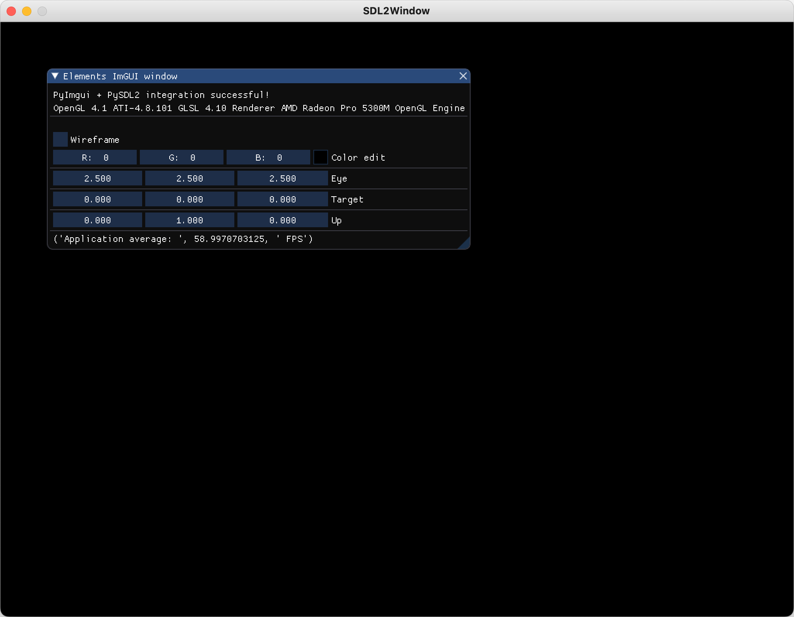

Example 2 
==========

**An Empty Window with an an ImGUIDecorator on top**

In this example we show how to generate a simple window with an ImGUIDecorator based on pySDL2. 

.. code-block:: python

    from pyGLV.GUI.Viewer import SDL2Window, ImGUIDecorator

        
    gWindow = SDL2Window()
    gGUI = ImGUIDecorator(gWindow)

    gGUI.init() #calls ImGUIDecorator::init()-->SDL2Window::init()

    running = True
    while running:
    gGUI.display()
    running = gGUI.event_input_process(running)
    gGUI.display_post()
    gGUI.shutdown()

