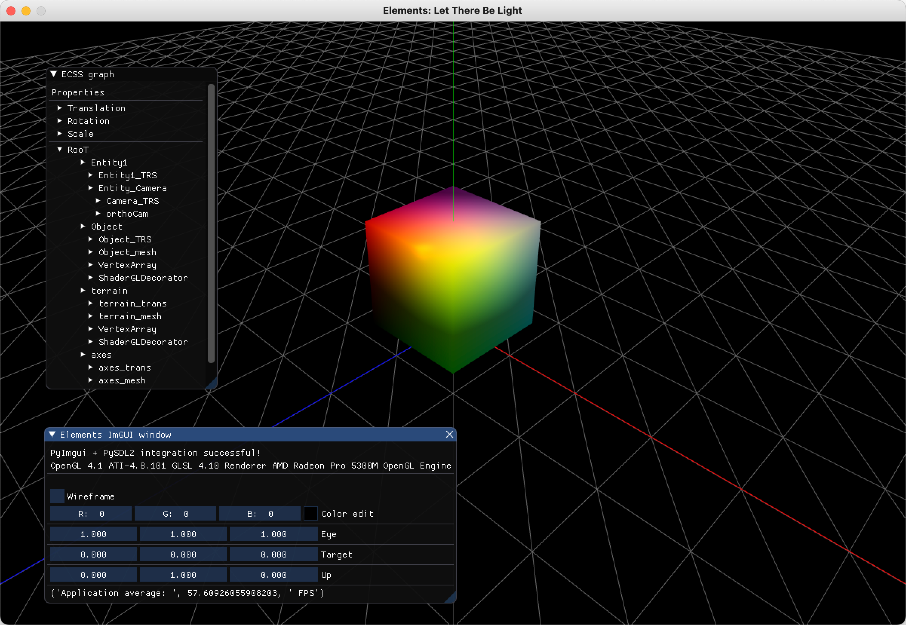

Example 5
==========================

In this example we show how to generate a simple window based on pySDL2. 

.. code-block:: python

    from pyGLV.GUI.Viewer import SDL2Window

    gWindow = SDL2Window(openGLversion=4)
    gWindow.init()

    # MAIN RENDERING LOOP
    running = True
    while running:
        gWindow.display()
        running = gWindow.event_input_process(running)
        gWindow.display_post()
    gWindow.shutdown()

